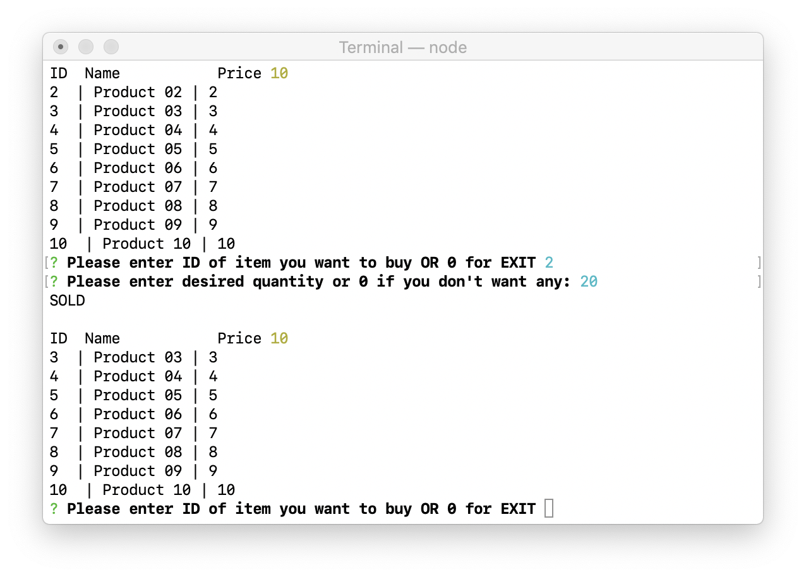
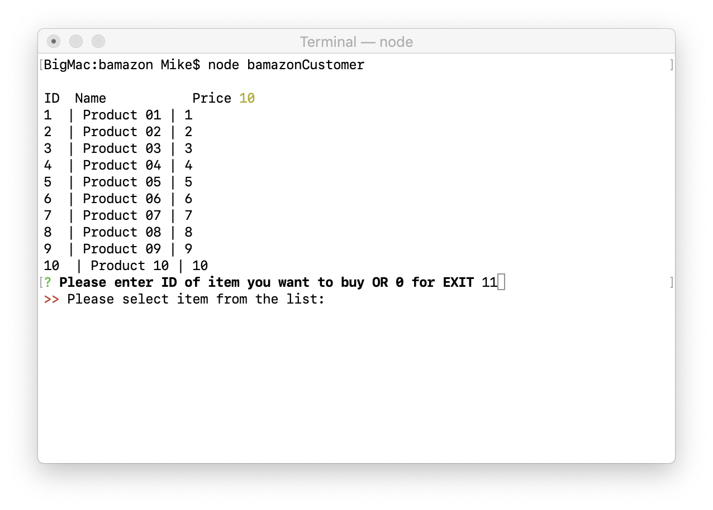
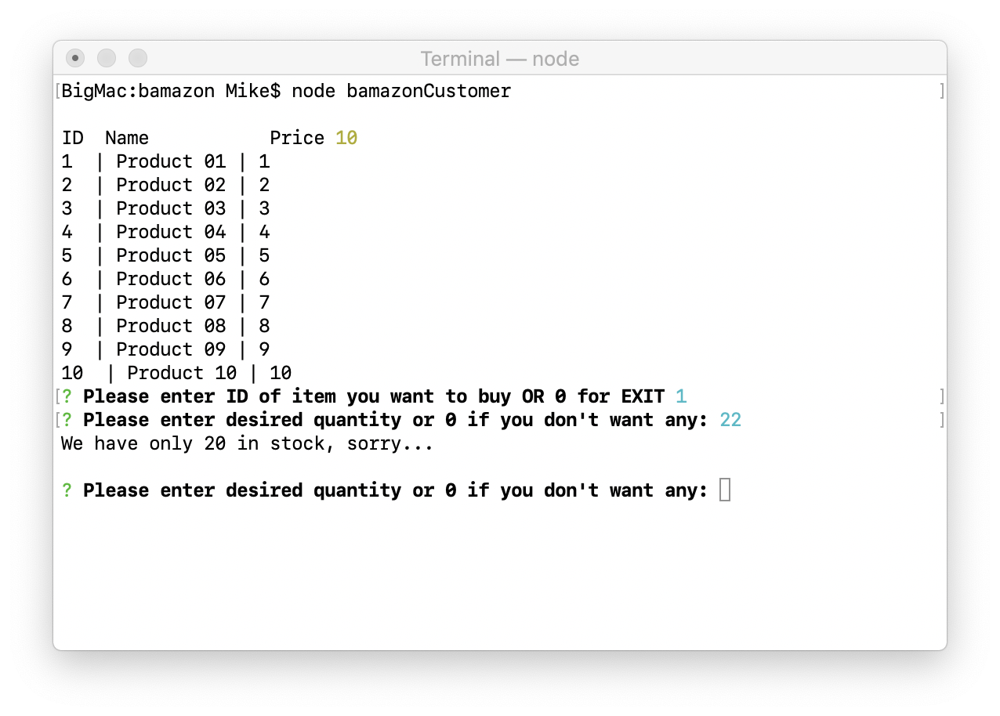
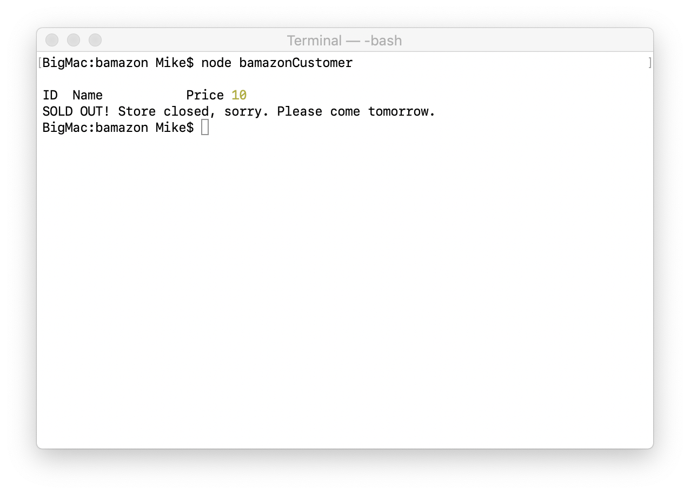

# bamazon

UCSD Homework - better amazon

The bamazon application is the next generation am@#on.
The most convinient way to by using CLI.

To run application Customer type: `node bamazonCustomer` and app display a list of all available items.

Customer asked to enter Item ID and quantity.

App verify that Customer entered valid Item ID:

When Customer enter desired quantity app check it against inventory.
If inventory is insufficient, app notify Customer about available quantity.
If we can fullfill the order app update database.

When everithing is sold app display

